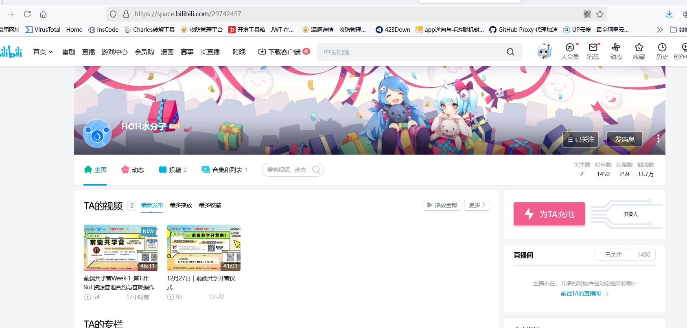
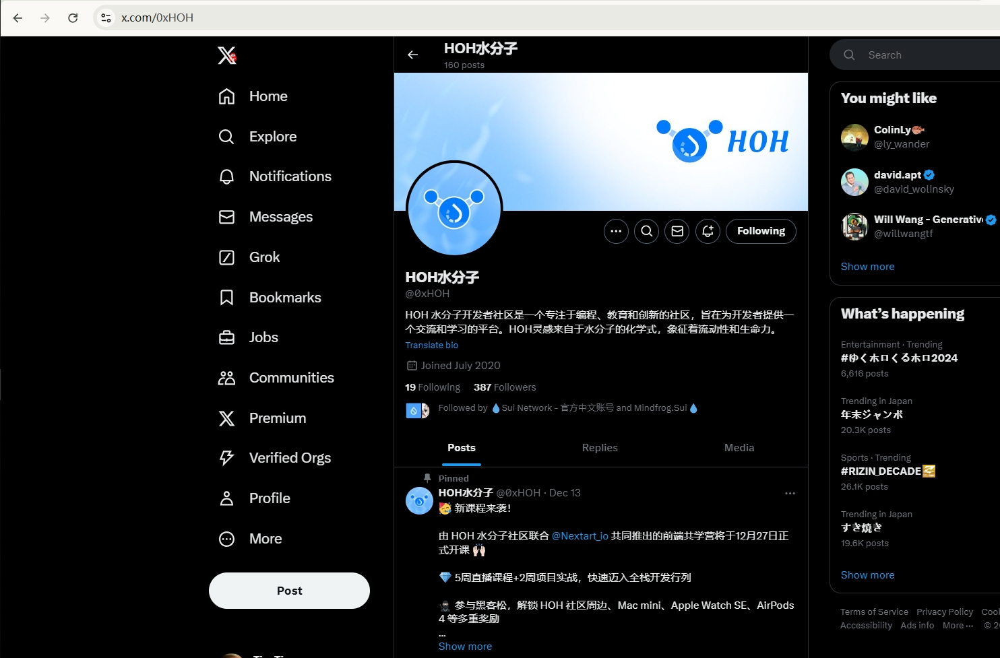
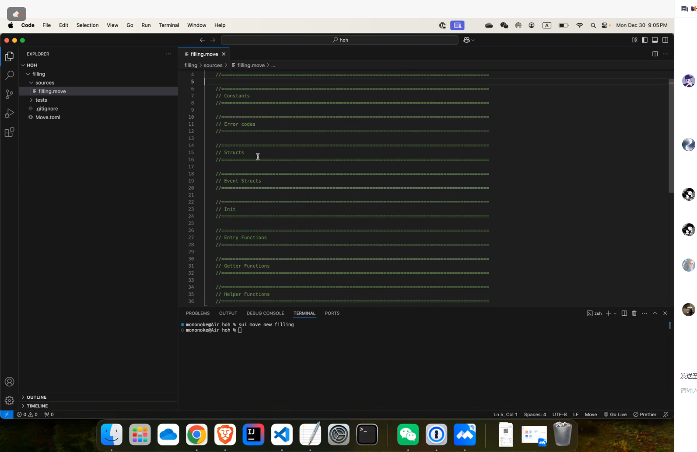

## 个人简介
- 工作经验: 3年
- 技术栈: `Python` `Move`
> 重要提示 请认真写自己的简介
- 3年web2安全测试测试经验，擅长Js逆向解密，接触sui move半年。
- 联系方式: QQ:669128884

## 作业
- [] 第一周:
- [] 第二周:
- [] 第三周:
- [] 第四周:

## b站，推特关注

- [x] b站关注截图: 
- [x] 推特关注截图: 

## 为共学营宣传（在朋友圈或者群聊中转发海报/文章）

- [] 宣传截图:

## 每周课程学习

- [x] 第一周:
    
- [] 第二周:
- [] 第三周:
- [] 第四周:

## 参加直播答疑

- [] 第一周:
- [] 第二周:
- [] 第三周:
- [] 第四周:

## 群里分享学习笔记

- [x] 第一篇笔记:https://blog.csdn.net/qq_46151595/article/details/144876638?sharetype=blogdetail&sharerId=144876638&sharerefer=PC&sharesource=qq_46151595&spm=1011.2480.3001.8118
- [x] 第二篇笔记:https://juejin.cn/post/7455123456071942163
- [] 第三篇笔记
- [] 第四篇笔记

## 对外输出学习笔记

- [x] 第一篇笔记【[Sui Move 前端共学（笔记一）](https://blog.csdn.net/qq_46151595/article/details/144876638?sharetype=blogdetail&sharerId=144876638&sharerefer=PC&sharesource=qq_46151595&spm=1011.2480.3001.8118)】
- [x] 第二篇笔记【[Sui Move 前端共学（笔记二）-ref表单域](https://juejin.cn/post/7455123456071942163)
- [] 第三篇笔记【学习笔记链接】
- [] 第四篇笔记【学习笔记链接】

## 在HOH社区公众号发布自己的技术文章

- [] 第一篇笔记【公众号文章链接】
- [] 第二篇笔记【公众号文章链接】
- [] 第三篇笔记【公众号文章链接】
- [] 第四篇笔记【公众号文章链接】

## 直播分享学习技巧/工具推荐

- [] 会议截图:

## 提交项目

- [] 项目提交

