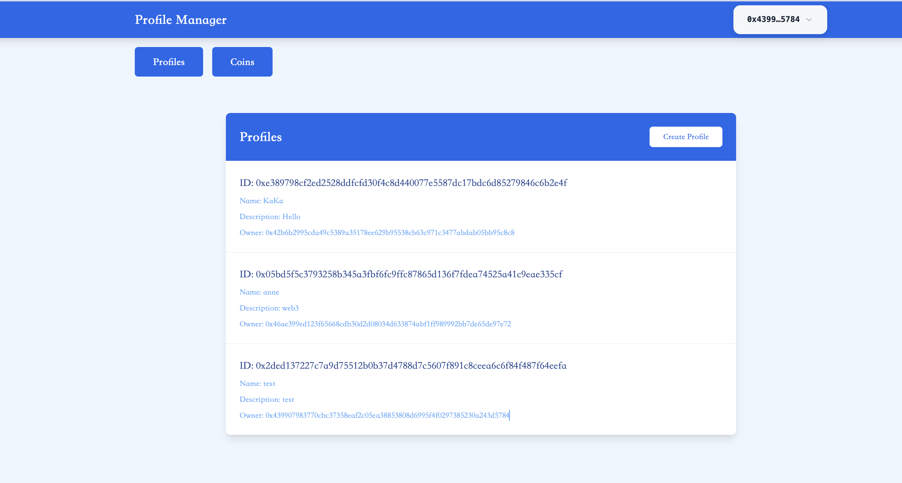
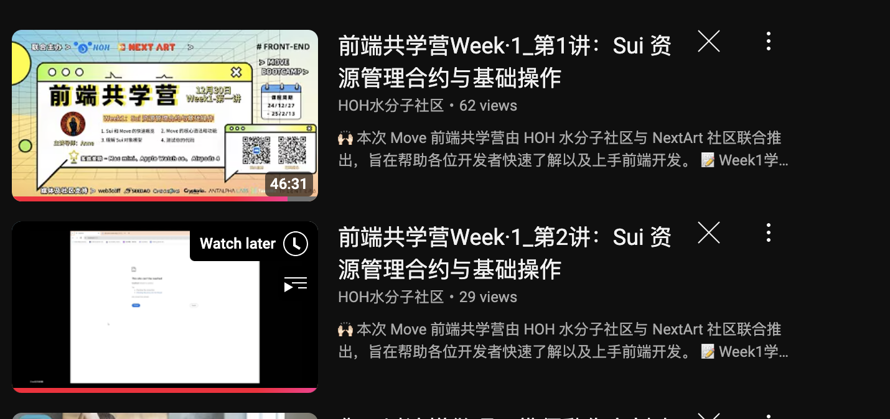
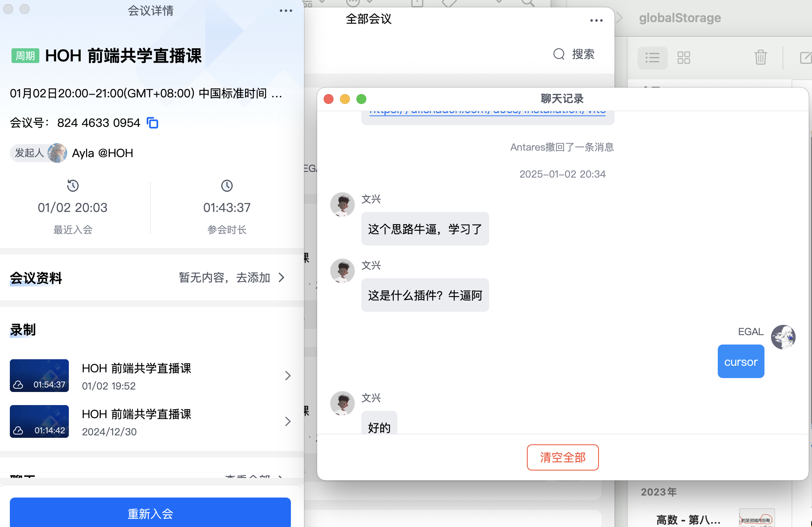

## 个人简介
- 工作经验: x年
- 技术栈: `Kotlin` `Java` `Python` `JavaScript` `Dart` `AI Tools` 
> 重要提示 请认真写自己的简介
- 多年web2开发经验，对web3感兴趣，一起组队参加黑客松吧。
- 联系方式: tg: `xxx`

## 作业
- [✅] 第一周:
- [] 第二周:
- [] 第三周:
- [] 第四周:

## b站，推特关注

- [✅] b站，推特关注截图: 

## 为共学营宣传（在朋友圈或者群聊中转发海报/文章）

- [] 宣传截图:

## 每周课程学习

- [✅] 第一周:
- [] 第二周:
- [] 第三周:
- [] 第四周:

## 参加直播答疑

- [✅] 第一周:
- [] 第二周:
- [] 第三周:
- [] 第四周:

## 群里分享学习笔记

- [] 第一篇笔记
- [] 第二篇笔记
- [] 第三篇笔记
- [] 第四篇笔记

## 对外输出学习笔记

- [] 第一篇笔记【学习笔记链接】
- [] 第二篇笔记【学习笔记链接】
- [] 第三篇笔记【学习笔记链接】
- [] 第四篇笔记【学习笔记链接】

## 在HOH社区公众号发布自己的技术文章

- [] 第一篇笔记【公众号文章链接】
- [] 第二篇笔记【公众号文章链接】
- [] 第三篇笔记【公众号文章链接】
- [] 第四篇笔记【公众号文章链接】

## 直播分享学习技巧/工具推荐

- [] 会议截图:

## 提交项目

- [] 项目提交

