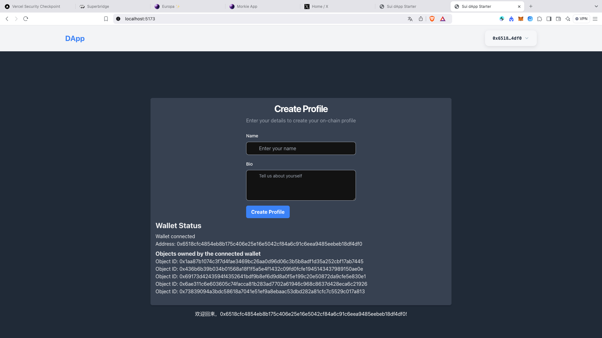

# Resource Manager



## 实操

```bash
0.1-to-Sui-Fullstack/fullstack/qiaopengjun5162 on  main [!?] via 🅒 base 
➜ cd week1/code/resource_manager 

0.1-to-Sui-Fullstack/fullstack/qiaopengjun5162/week1/code/resource_manager on  main [!?] via 🅒 base 
➜ ls
Move.lock Move.toml build     sources   tests


0.1-to-Sui-Fullstack/fullstack/qiaopengjun5162/week1/code/resource_manager on  main [!?] via 🅒 base took 2.4s 
➜ sui client envs    
╭─────────┬─────────────────────────────────────┬────────╮
│ alias   │ url                                 │ active │
├─────────┼─────────────────────────────────────┼────────┤
│ devnet  │ https://fullnode.devnet.sui.io:443  │        │
│ mainnet │ https://fullnode.mainnet.sui.io:443 │        │
│ testnet │ https://fullnode.testnet.sui.io:443 │ *      │
╰─────────┴─────────────────────────────────────┴────────╯

0.1-to-Sui-Fullstack/fullstack/qiaopengjun5162/week1/code/resource_manager on  main [!?] via 🅒 base 
➜ sui client active-address
0x35370841d2e69b495b1e2f944a3087e4242f314e503691a00b054e0ee2a45a73

0.1-to-Sui-Fullstack/fullstack/qiaopengjun5162/week1/code/resource_manager on  main [!?] via 🅒 base 
➜ sui client addresses     
╭──────────────────────┬────────────────────────────────────────────────────────────────────┬────────────────╮
│ alias                │ address                                                            │ active address │
├──────────────────────┼────────────────────────────────────────────────────────────────────┼────────────────┤
│ dazzling-chrysoprase │ 0x35370841d2e69b495b1e2f944a3087e4242f314e503691a00b054e0ee2a45a73 │ *              │
╰──────────────────────┴────────────────────────────────────────────────────────────────────┴────────────────╯

0.1-to-Sui-Fullstack/fullstack/qiaopengjun5162/week1/code/resource_manager on  main [!?] via 🅒 base 
➜ sui client publish --gas-budget 100000000 --skip-fetch-latest-git-deps                                
INCLUDING DEPENDENCY Sui
INCLUDING DEPENDENCY MoveStdlib
BUILDING resource_manager
Successfully verified dependencies on-chain against source.
Transaction Digest: D4ud1VGYPmgbU8f88A5mGydW14GPYy3hX4yn4tNVEDkh
╭──────────────────────────────────────────────────────────────────────────────────────────────────────────────╮
│ Transaction Data                                                                                             │
├──────────────────────────────────────────────────────────────────────────────────────────────────────────────┤
│ Sender: 0x35370841d2e69b495b1e2f944a3087e4242f314e503691a00b054e0ee2a45a73                                   │
│ Gas Owner: 0x35370841d2e69b495b1e2f944a3087e4242f314e503691a00b054e0ee2a45a73                                │
│ Gas Budget: 100000000 MIST                                                                                   │
│ Gas Price: 1000 MIST                                                                                         │
│ Gas Payment:                                                                                                 │
│  ┌──                                                                                                         │
│  │ ID: 0x01975e952e83c1cc75daf05a5a9246b49eb9fe35a300379e0b967909663c39b4                                    │
│  │ Version: 236314045                                                                                        │
│  │ Digest: HZiinpekBgGz6UWtZ9SFrVR7xc33t4jq9LdAydASkjrL                                                      │
│  └──                                                                                                         │
│                                                                                                              │
│ Transaction Kind: Programmable                                                                               │
│ ╭──────────────────────────────────────────────────────────────────────────────────────────────────────────╮ │
│ │ Input Objects                                                                                            │ │
│ ├──────────────────────────────────────────────────────────────────────────────────────────────────────────┤ │
│ │ 0   Pure Arg: Type: address, Value: "0x35370841d2e69b495b1e2f944a3087e4242f314e503691a00b054e0ee2a45a73" │ │
│ ╰──────────────────────────────────────────────────────────────────────────────────────────────────────────╯ │
│ ╭─────────────────────────────────────────────────────────────────────────╮                                  │
│ │ Commands                                                                │                                  │
│ ├─────────────────────────────────────────────────────────────────────────┤                                  │
│ │ 0  Publish:                                                             │                                  │
│ │  ┌                                                                      │                                  │
│ │  │ Dependencies:                                                        │                                  │
│ │  │   0x0000000000000000000000000000000000000000000000000000000000000001 │                                  │
│ │  │   0x0000000000000000000000000000000000000000000000000000000000000002 │                                  │
│ │  └                                                                      │                                  │
│ │                                                                         │                                  │
│ │ 1  TransferObjects:                                                     │                                  │
│ │  ┌                                                                      │                                  │
│ │  │ Arguments:                                                           │                                  │
│ │  │   Result 0                                                           │                                  │
│ │  │ Address: Input  0                                                    │                                  │
│ │  └                                                                      │                                  │
│ ╰─────────────────────────────────────────────────────────────────────────╯                                  │
│                                                                                                              │
│ Signatures:                                                                                                  │
│    HwD1kzE1ZFVzZ+6gbmbUPojatGzmm/aIee6J7uXtzIvEGi4aMcbjvfPUdVp+WyPdd8GwEgXqMrxrhopUZ/NqCQ==                  │
│                                                                                                              │
╰──────────────────────────────────────────────────────────────────────────────────────────────────────────────╯
╭───────────────────────────────────────────────────────────────────────────────────────────────────╮
│ Transaction Effects                                                                               │
├───────────────────────────────────────────────────────────────────────────────────────────────────┤
│ Digest: D4ud1VGYPmgbU8f88A5mGydW14GPYy3hX4yn4tNVEDkh                                              │
│ Status: Success                                                                                   │
│ Executed Epoch: 603                                                                               │
│                                                                                                   │
│ Created Objects:                                                                                  │
│  ┌──                                                                                              │
│  │ ID: 0x23f584b9fd03364882f1eaf6a8354f14d7707591c50c462aad60c52ac4de20e3                         │
│  │ Owner: Shared( 236314046 )                                                                     │
│  │ Version: 236314046                                                                             │
│  │ Digest: DwbaPQHgeCnkFKiMSuwzjUWEAFuMg5jVmNjQfY4D7Ppw                                           │
│  └──                                                                                              │
│  ┌──                                                                                              │
│  │ ID: 0xa732060e4a37ec9abb8aa436739e423916d807569890a0ad068726bc481e1e74                         │
│  │ Owner: Immutable                                                                               │
│  │ Version: 1                                                                                     │
│  │ Digest: rPzokQQEWiB7RdB35aVJ5v51rNtCyV25ScbMSucLn3n                                            │
│  └──                                                                                              │
│  ┌──                                                                                              │
│  │ ID: 0xff205b3cc2b46c9c9fa29e3c0f6fc8548f6858f9456fd5f935594fd37c68ce9e                         │
│  │ Owner: Account Address ( 0x35370841d2e69b495b1e2f944a3087e4242f314e503691a00b054e0ee2a45a73 )  │
│  │ Version: 236314046                                                                             │
│  │ Digest: HPqsQdtq6Voq7aVzMp5ymNMxcad8Uv7ouwR1MqvP5mur                                           │
│  └──                                                                                              │
│ Mutated Objects:                                                                                  │
│  ┌──                                                                                              │
│  │ ID: 0x01975e952e83c1cc75daf05a5a9246b49eb9fe35a300379e0b967909663c39b4                         │
│  │ Owner: Account Address ( 0x35370841d2e69b495b1e2f944a3087e4242f314e503691a00b054e0ee2a45a73 )  │
│  │ Version: 236314046                                                                             │
│  │ Digest: YtnpGG1jMVpPm7de1hCsZefPAK8cDUwZ9mWRKGLzqgZ                                            │
│  └──                                                                                              │
│ Gas Object:                                                                                       │
│  ┌──                                                                                              │
│  │ ID: 0x01975e952e83c1cc75daf05a5a9246b49eb9fe35a300379e0b967909663c39b4                         │
│  │ Owner: Account Address ( 0x35370841d2e69b495b1e2f944a3087e4242f314e503691a00b054e0ee2a45a73 )  │
│  │ Version: 236314046                                                                             │
│  │ Digest: YtnpGG1jMVpPm7de1hCsZefPAK8cDUwZ9mWRKGLzqgZ                                            │
│  └──                                                                                              │
│ Gas Cost Summary:                                                                                 │
│    Storage Cost: 14455200 MIST                                                                    │
│    Computation Cost: 1000000 MIST                                                                 │
│    Storage Rebate: 978120 MIST                                                                    │
│    Non-refundable Storage Fee: 9880 MIST                                                          │
│                                                                                                   │
│ Transaction Dependencies:                                                                         │
│    5MVU6iZs2Rm5STRLyUbfmWSNntVGVcKjfnu4FzcgP83C                                                   │
│    Gtwgse64nSVXhQvmqCpwCe5xJz9N4VypvEGJUy5DyG4e                                                   │
╰───────────────────────────────────────────────────────────────────────────────────────────────────╯
╭─────────────────────────────╮
│ No transaction block events │
╰─────────────────────────────╯

╭─────────────────────────────────────────────────────────────────────────────────────────────────────────────╮
│ Object Changes                                                                                              │
├─────────────────────────────────────────────────────────────────────────────────────────────────────────────┤
│ Created Objects:                                                                                            │
│  ┌──                                                                                                        │
│  │ ObjectID: 0x23f584b9fd03364882f1eaf6a8354f14d7707591c50c462aad60c52ac4de20e3                             │
│  │ Sender: 0x35370841d2e69b495b1e2f944a3087e4242f314e503691a00b054e0ee2a45a73                               │
│  │ Owner: Shared( 236314046 )                                                                               │
│  │ ObjectType: 0xa732060e4a37ec9abb8aa436739e423916d807569890a0ad068726bc481e1e74::resource_manager::State  │
│  │ Version: 236314046                                                                                       │
│  │ Digest: DwbaPQHgeCnkFKiMSuwzjUWEAFuMg5jVmNjQfY4D7Ppw                                                     │
│  └──                                                                                                        │
│  ┌──                                                                                                        │
│  │ ObjectID: 0xff205b3cc2b46c9c9fa29e3c0f6fc8548f6858f9456fd5f935594fd37c68ce9e                             │
│  │ Sender: 0x35370841d2e69b495b1e2f944a3087e4242f314e503691a00b054e0ee2a45a73                               │
│  │ Owner: Account Address ( 0x35370841d2e69b495b1e2f944a3087e4242f314e503691a00b054e0ee2a45a73 )            │
│  │ ObjectType: 0x2::package::UpgradeCap                                                                     │
│  │ Version: 236314046                                                                                       │
│  │ Digest: HPqsQdtq6Voq7aVzMp5ymNMxcad8Uv7ouwR1MqvP5mur                                                     │
│  └──                                                                                                        │
│ Mutated Objects:                                                                                            │
│  ┌──                                                                                                        │
│  │ ObjectID: 0x01975e952e83c1cc75daf05a5a9246b49eb9fe35a300379e0b967909663c39b4                             │
│  │ Sender: 0x35370841d2e69b495b1e2f944a3087e4242f314e503691a00b054e0ee2a45a73                               │
│  │ Owner: Account Address ( 0x35370841d2e69b495b1e2f944a3087e4242f314e503691a00b054e0ee2a45a73 )            │
│  │ ObjectType: 0x2::coin::Coin<0x2::sui::SUI>                                                               │
│  │ Version: 236314046                                                                                       │
│  │ Digest: YtnpGG1jMVpPm7de1hCsZefPAK8cDUwZ9mWRKGLzqgZ                                                      │
│  └──                                                                                                        │
│ Published Objects:                                                                                          │
│  ┌──                                                                                                        │
│  │ PackageID: 0xa732060e4a37ec9abb8aa436739e423916d807569890a0ad068726bc481e1e74                            │
│  │ Version: 1                                                                                               │
│  │ Digest: rPzokQQEWiB7RdB35aVJ5v51rNtCyV25ScbMSucLn3n                                                      │
│  │ Modules: resource_manager                                                                                │
│  └──                                                                                                        │
╰─────────────────────────────────────────────────────────────────────────────────────────────────────────────╯
╭───────────────────────────────────────────────────────────────────────────────────────────────────╮
│ Balance Changes                                                                                   │
├───────────────────────────────────────────────────────────────────────────────────────────────────┤
│  ┌──                                                                                              │
│  │ Owner: Account Address ( 0x35370841d2e69b495b1e2f944a3087e4242f314e503691a00b054e0ee2a45a73 )  │
│  │ CoinType: 0x2::sui::SUI                                                                        │
│  │ Amount: -14477080                                                                              │
│  └──                                                                                              │
╰───────────────────────────────────────────────────────────────────────────────────────────────────╯

```

## Reference

- <https://sdk.mystenlabs.com/dapp-kit/create-dapp>
- <https://ui.shadcn.com/docs/installation/vite>
- <https://www.bilibili.com/video/BV1Aa6zYdEin/?vd_source=bba3c74b0f6a3741d178163e8828d21b>
- <https://testnet.suivision.xyz/account/0x35370841d2e69b495b1e2f944a3087e4242f314e503691a00b054e0ee2a45a73>
- <https://testnet.suivision.xyz/package/0xa732060e4a37ec9abb8aa436739e423916d807569890a0ad068726bc481e1e74>
