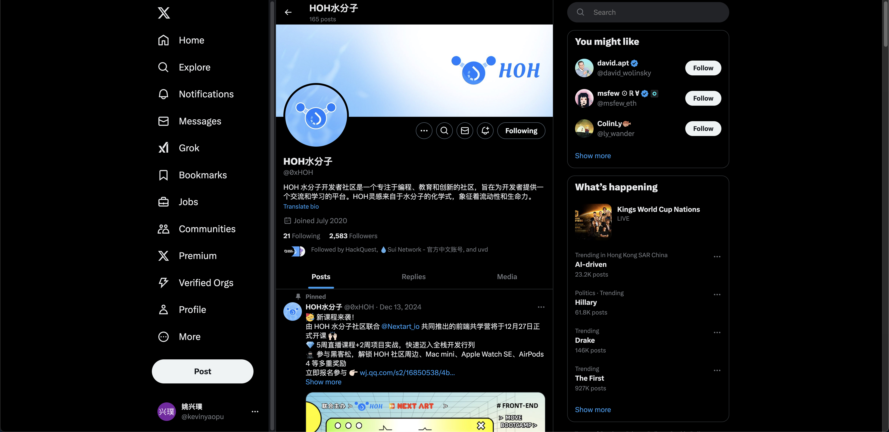
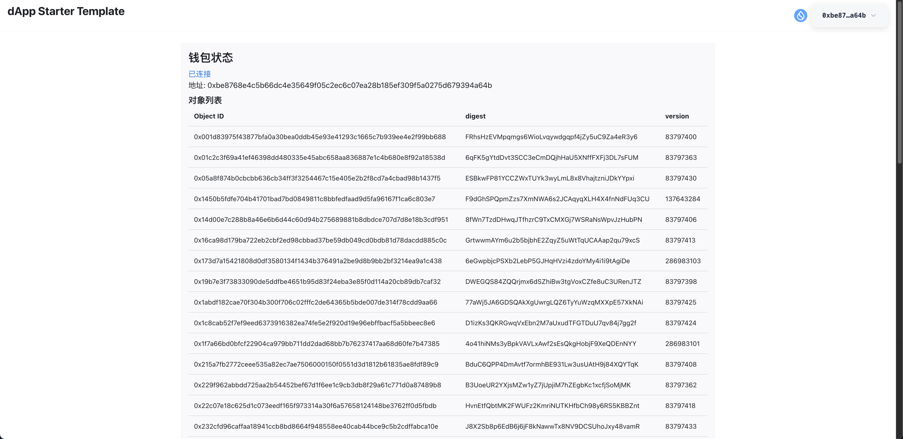
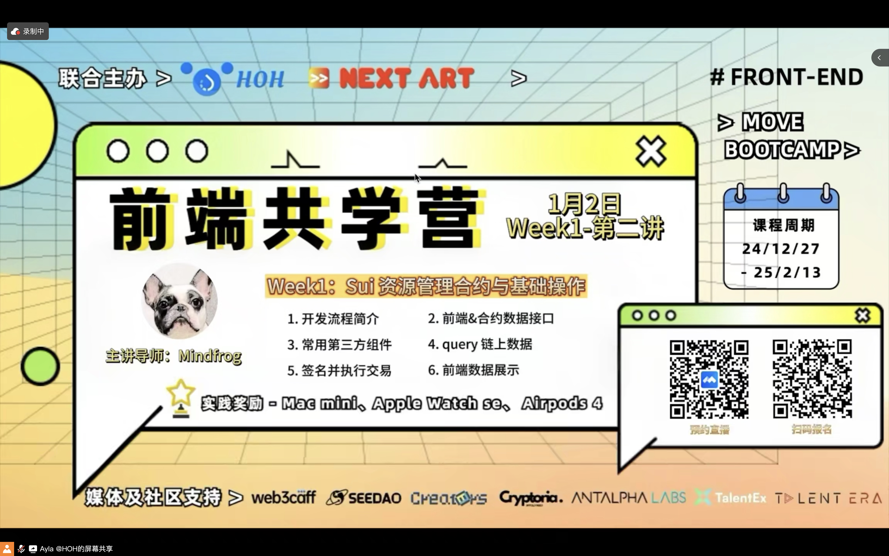

<!--
 * @Author: yaoxingpu yaoxpu@163.com
 * @Date: 2024-12-31 10:39:02
 * @LastEditors: yaoxingpu yaoxpu@163.com
 * @LastEditTime: 2025-01-04 23:19:23
 * @FilePath: /0.1-to-Sui-Fullstack/fullstack/yaoxingpu/readme.md
 * @Description: 
 * 
-->
## 个人简介
- 工作经验: 8年
- 技术栈: `javaScropt` `TypeScropt`
> 重要提示 请认真写自己的简介
- 一名充满激情的前端开发人员，专注于用户体验设计和高性能 Web 应用的开发，熟悉多种前端框架与工具，追求代码的优雅与效率。多年web2开发经验，对web3特别感兴趣，想通过Sui入门区块链
- 联系方式: tg: `allen_8605`

## 作业
- [x] 第一周:
- [] 第二周:
- [] 第三周:
- [] 第四周:

## b站，推特关注

- [x] b站，推特关注截图: 

## 为共学营宣传（在朋友圈或者群聊中转发海报/文章）

- [] 宣传截图:

## 每周课程学习

- [x] 第一周:
- [] 第二周:
- [] 第三周:
- [] 第四周:

## 参加直播答疑

- [x] 第一周:
- [] 第二周:
- [] 第三周:
- [] 第四周:

## 群里分享学习笔记

- [] 第一篇笔记
- [] 第二篇笔记
- [] 第三篇笔记
- [] 第四篇笔记

## 对外输出学习笔记

- [] 第一篇笔记【学习笔记链接】
- [] 第二篇笔记【学习笔记链接】
- [] 第三篇笔记【学习笔记链接】
- [] 第四篇笔记【学习笔记链接】

## 在HOH社区公众号发布自己的技术文章

- [] 第一篇笔记【公众号文章链接】
- [] 第二篇笔记【公众号文章链接】
- [] 第三篇笔记【公众号文章链接】
- [] 第四篇笔记【公众号文章链接】

## 直播分享学习技巧/工具推荐

- [] 会议截图:

## 提交项目

- [] 项目提交

